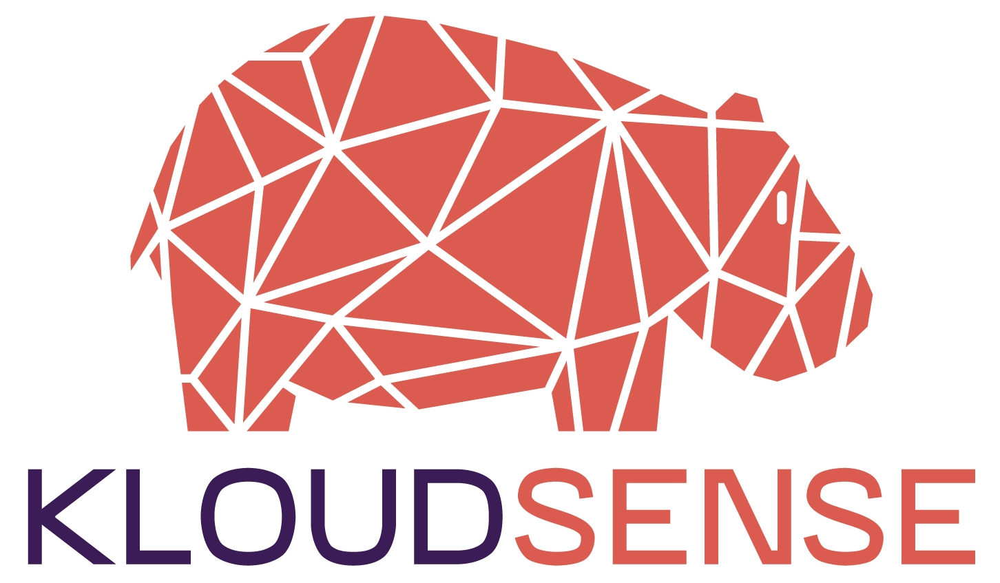

# 

[](https://github.com/kloudsense/kloudsense/releases/tag/0.2-beta) [](https://github.com/kloudsense/kloudsense/releases/tag/0.2-beta) [](http://www.apache.org/licenses/LICENSE-2.0.txt) [](https://github.com/kloudsense/kloudsense/releases/tag/0.2-beta)


KloudSense BigData Observability Platform. Developed by Keedio.


## What is it?
KloudSense is a Observability platform for monitoring, alerting, analytics and prediction of a BigData cluster's state. This tool provides information about the current state of the cluster, as well as being able to predict possible errors. With these predictions, KloudSense automatically undertakes corrective procedures in the cluster's infrastructure. These predictions are based on its own rules-engine, to prevent these errors from occurring.


## Capabilities
KloudSense capabilities depends on the cluster’s framework. Currently, KloudSense only supports DC/OS clusters monitoring. Development is on its way to support Cloudera's based clusters.


### Compatibility
|  Target  | Metrics | Logs |   Prediction   |
|:--------:|:-------:|:----:|:--------------:|
| DC/OS    | Yes     | Yes  | In Development |
| Cloudera | No      | No   | No             |


### DC/OS (D2IQ)
#### Data Collected
KloudSense can collect data from DC/OS usage metrics, DC/OS components logs, and running containers logs. All this information is stored in a CrateDB database for analytics purposes.

#### Analytics
Currently are in development: predictive modelling, metrics monitoring and anomaly detection for detect possible future errors and determine the root causes.

#### Storage
Kloudsense can store as much information in its database as it is allowed to. Therefore, CrateDB is used as the main database of the platform. CrateDB can store this information in a distributed way, keeping several copies to guarantee the availability of the collected data.

#### Visualization
KloudSense works with Grafana to create dashboards  enabling graphical representation of the current state of the cluster.

#### Alerts
Alerts can be defined in Prometheus. When any alert triggers, Prometheus sends this information to the rules engine to begin their evaluation and alert the users with Alertmanager.

### Cloudera

---

*For future versions*

---


## Architecture
KloudSense is an OpenSource project, and also uses some projects Apache licensed. This projects are:

  - **Grafana**: Grafana is the Front-End module to draw Dashboards with the data stored in Prometheus.
  - **Prometheus**: Prometheus is used to ingest short-term storage of metrics (15 days by default). Also acting as a data source for Grafana.
  - **Alertmanager**: Sends alerts messages when a Prometheus alert triggers.
  - **CrateDB-CE**: CrateDB Community Edition for long-term  storage of metrics, containers logs and system logs.
  - **Crate-Adapter**: **(Crate-Prometheus Adapter for us (CPA))** Connect Prometheus with CrateDB for remote Write/Read.
  - **Drools**: Expert system based on rules to determine the cause of the alert and offers the correct solution. When the rules have been determined the error, Drools can trigger the execution of one or more Airflow DAGs to try to fix the error automatically.
  - **Airflow**: Workflow Manager to execute work on monitored nodes that perform maintenance tasks.


KloudSense own componentes developed by Keedio:
  - **Prometheus-Drools Adapter (PDA)**: This module receives the alerts sent by Prometheus (like the alerts sent to Alertmanager) and sends each of these alerts to a specified container in Drools to be processed.
  - **Rsyslog-Config**: These configuration files and codes are used to send the DC/OS system and containers logs to CrateDB for further analysis.
  - **Docker-Compose Deploy**: Deploys in standalone and  enables connections of this system with docker-compose
  - **Analytics**: Offers two types of models; predictive models and anomaly detection models. KloudSense allows the user both to detect errors that currently affects the cluster as well as future situations that may require preventive action.
  - **Alert Rules**: Main Prometheus rules system for detection of the more common errors.
  - **Drools Rules**: Rules to make decisions based on Prometheus alerts.
  - **Airflow DAGs**: DAGs of Apache Airflow to make actions on the cluster. 

The rules, dags and config are customizable for each cluster and context.


### Architecture Diagram


## Component EndPoints
  - **Grafana**: http://localhost:20000
  - **Prometheus**: http://localhost:20100
  - **Alertmanager**: http://localhost:20110
  - **CrateDB-CE-lb-1-UI**: http://localhost:20200
  - **CrateDB-CE-lb-2-UI**: http://localhost:20201
  - **CrateDB-CE-lb-1-PSQL**: http://localhost:20210
  - **CrateDB-CE-lb-2-PSQL**: http://localhost:20211
  - **Airflow-Webserver**: http://localhost:20300
  - **Drools-WildFly**: http://localhost:20400
  - **Drools-WildFly-Management-Console**: http://localhost:20410 Credentials: (User: 'keedio' Password: 'keedio')
  - **Drools-Business-Central**: http://localhost:20400/business-central Credentials: (User: 'workbench' Password: 'workbench')


## Deploy Modes
  - **Standalone with Docker**: Available
  - **Apache Mesos**: *for future versions*


## Configuration and Deploy
KloudSense is composed by some modules to build all the system components. Here are the instructions to configure the platform, download its modules and run it.


### Dependencies
  - **Docker-CE**: >= v18
  - **Docker-Compose** >= 1.23.1
  - **Ansible** >= 2.8.5
  - **Kernel Config**: Run the following commands to increase the kernel max virtual memory areas (vm.max_map_count) required by CrateDB
      ```sh
      echo "vm.max_map_count = 262144" >> /etc/sysctl.conf 
      sysctl -w vm.max_map_count=262144

      ## If you only change the '/etc/sysctl.conf' itis 
      ```


### Download 
```sh
# Download root repository
git clone https://github.com/kloudsense/kloudsense.git
cd kloudsense
```


### Configuration
There are some files you can edit to configure KloudSense:
  - **KloudSense properties file**: ( *./config/kloudsense.properties* ) Main config file
  - **DC/OS cluster inventory file**: ( *./dcos/bootstrap/dcos_hosts.inventory* ) Ansible inventory file
  - **Prometheus Auto-Discovery DC/OS nodes**: ( *./dcos/config/prometheus/resolv.conf* ) Linux resolv file with the nameserver of DC/OS


---
### DC/OS Deploy

#### Intructions
  1. Edit the Mesos DNS IP address of the DC/OS Cluster in *./dcos/config/prometheus/resolv.conf*.
     ```sh
     sed -i 's/nameserver .*/nameserver <MESOS_DNS_IP>/g' dcos/config/prometheus/resolv.conf
     ```
  2. Create a ssh key in your monitoring host and add the public key to each DC/OS node (Master and Agents).
      ```sh
      ssh-keygen
      ssh-copy-id -i ~/.ssh/mykey user@host
      ssh-keyscan -H host >> ~/.ssh/known_hosts
      ```
      If your cluster is composed of many nodes, you can use a loop to make the config process more manageable.

        **NOTE!**: the user to login in the DC/OS hosts must have administrative permision.

      To help you in this step, there is a little bash script to make this faster. The script requires that the inventory file used in step 3 was completed.
      * Script path = tools/ssh_key_installer.sh

  3. Edit the inventory file and configure your nodes.
      ```sh
      vim dcos/config/bootstrap/dcos_hosts.inventory
      # IMPORTANT! Fill all the sections:
      #     * cluster (all nodes)
      #     * master (master nodes)
      #     * agents (public and private agents nodes)
      #     * public_agents (public agent nodes)
      #     * private_agents (private agent nodes)
      ```


#### Download and build KloudSense Modules
KloudSense has an interactive shell based on bash for the configuration, management and deployment of the system. This shell is called 'kshell'. We recommend to use it with the following steps:
```sh
# Run the assistant
./kshell

# Set the configuration to DC/OS cluster
ks mode dcos

# Check the current modules status
ks module list

> [*] Module Name: ks-alertmanager:0.2-beta                            [absent] [not-pulled]
> [*] Module Name: ks-prometheus:0.2-beta                              [absent] [not-pulled]
> [*] Module Name: ks-grafana-meta:0.2-beta                            [absent] [not-pulled]
> [*] Module Name: ks-grafana-dcos:0.1-beta                            [absent] [not-pulled]
> [*] Module Name: ks-cratedb-ce:0.1.2-beta                            [absent] [not-pulled]
> [*] Module Name: ks-cp-adapter:0.1.1-beta                            [absent] [not-pulled]
> [*] Module Name: ks-airflow:0.1-beta                                 [absent] [not-pulled]
> [*] Module Name: ks-rules-engine:0.1-beta                            [absent] [not-pulled]
> [*] Module Name: ks-rules-engine-connector:0.1-beta                  [absent] [not-pulled]


# Download modules repositories
ks module pull

# Check if all the modules are pulled
ks module list

> [*] Module Name: ks-alertmanager:0.2-beta                            [absent] [pulled]
> [*] Module Name: ks-prometheus:0.2-beta                              [absent] [pulled]
> [*] Module Name: ks-grafana-meta:0.2-beta                            [absent] [pulled]
> [*] Module Name: ks-grafana-dcos:0.1-beta                            [absent] [pulled]
> [*] Module Name: ks-cratedb-ce:0.1.2-beta                            [absent] [pulled]
> [*] Module Name: ks-cp-adapter:0.1.1-beta                            [absent] [pulled]
> [*] Module Name: ks-airflow:0.1-beta                                 [absent] [pulled]
> [*] Module Name: ks-rules-engine:0.1-beta                            [absent] [pulled]
> [*] Module Name: ks-rules-engine-connector:0.1-beta                  [absent] [pulled]


# Build the modules (it can take a while, but only is necessary the first time)
ks module build

# Check if all the modules are builded
ks module list
> [*] Module Name: ks-alertmanager:0.2-beta                            [present] [pulled]
> [*] Module Name: ks-prometheus:0.2-beta                              [present] [pulled]
> [*] Module Name: ks-grafana-meta:0.2-beta                            [present] [pulled]
> [*] Module Name: ks-grafana-dcos:0.1-beta                            [present] [pulled]
> [*] Module Name: ks-cratedb-ce:0.1.2-beta                            [present] [pulled]
> [*] Module Name: ks-cp-adapter:0.1.1-beta                            [present] [pulled]
> [*] Module Name: ks-airflow:0.1-beta                                 [present] [pulled]
> [*] Module Name: ks-rules-engine:0.1-beta                            [present] [pulled]
> [*] Module Name: ks-rules-engine-connector:0.1-beta                  [present] [pulled]

# If you see the same output, it means that all modules are ready
```


### Deploy and Run
```sh
# Run the assistant 
./kshell

# Set the configuration to DC/OS cluster 
ks mode dcos

# Run Standalone deploy
ks system up
```


### Stop Platform
```sh
# Run the assistant 
./kshell

# Stop the containers
ks system stop
```


### Start Platform
```sh
# Run the assistant 
./kshell

# Stop the containers
ks system start
```


### Help
If you have any problem with the assistant commands try following the help messages
```sh
# Main Help
ks help

# Module Help
ks <MODULE> help
```
---


### Cloudera Deploy

---

*for future versions*

---


## Ownership

### Authors
 - Alejandro Villegas - LEAD Developer (<avillegas@keedio.com>)

### Contact
 - Alejandro Villegas - (<avillegas@keedio.com>)

### Owner
 - Keedio (<keedio@keedio.com>)


## License
KloudSense is distributed under [Apache 2.0 License](https://github.com/kloudsense/kloudsense/blob/master/LICENSE)
